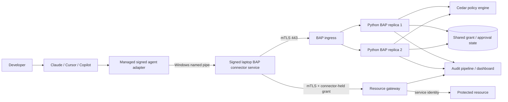
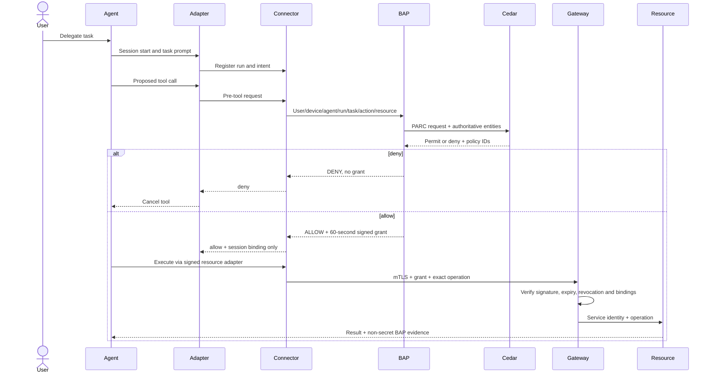

# Enterprise BAP architecture

## Purpose

BAP separates an agent's ability to propose work from its authority to execute against enterprise resources. Developers and agents have no standing resource credential. Authority is created only after central policy evaluates a registered action and is expressed as a short-lived, tightly bound grant.

## End-to-end component flow



The local demo maps these boundaries to localhost ports, but still uses a named pipe between endpoint binaries, mTLS for enterprise calls, two BAP replicas, a real Cedar evaluation, asymmetric grants, and an independently enforcing gateway.

## Authorization request and decision

The connector sends trusted, normalized evidence:

```json
{
  "user": "stable-user-id",
  "device": "managed-device-id",
  "agent": "claude-code",
  "agent_run": "cc-run-123",
  "task": "Read the development customer record",
  "action": "database.read",
  "resource": "dev-customer-db"
}
```

BAP maps this into Cedar principal/action/resource/context. The human is the principal; normalized business action and catalog resource are stable entities; agent identity, run, device posture, task, and approval are request context. See [POLICY_MODEL.md](enterprise_demo/POLICY_MODEL.md).

BAP returns:

- `ALLOW`: issue a short-lived grant bound to principal, agent run, action, resource, audience, policy revision, issue time, expiry, and unique ID;
- `REQUIRE_APPROVAL`: create an approval request but no executable grant;
- `DENY`: issue no grant and return the matched forbid or default-deny evidence.

## Registered execution sequence



The model and command line never receive the grant. The local resource client carries only a BAP session identifier; the connector retrieves its session-held grant.

## Evidence and audit chain

One `trace_id` follows the agent session. Each proposed resource action receives a `request_id`; every policy evaluation receives a `decision_id`; a permitted action may receive a `grant_id`; and only a gateway attempt receives an `execution_id`. These identifiers are carried through the front door, BAP replica, connector, resource gateway, and protected resource. The access view therefore answers, without guessing or timestamp joins: who requested access, from which device and agent run, for what task/action/resource, which policy and approver decided it, which grant was created, and whether the target actually executed it.

The demo database is append-only through database triggers, hashes each event to its predecessor, indexes correlation fields, excludes grant tokens, and persists by default. The connector has a durable write-through audit outbox: a pre-execution audit failure causes fail-closed behavior; a post-execution result is queued for replay so completed work is not lost from evidence. The local integrity badge detects modification but is not a substitute for production custody.

Production separates decision serving from replicated audit ingestion. Idempotent events flow through Kafka/event streaming into partitioned PostgreSQL for investigations, the SIEM for detection, and immutable/WORM storage with independently signed checkpoints for retention and non-repudiation. Dashboard/API access uses enterprise SSO and RBAC. See [audit/README.md](enterprise_demo/audit/README.md).

## Approval sequence

For a write, Cedar initially denies `databaseWrite` because `humanApproved=false`. BAP separately evaluates the `requestDatabaseWriteApproval` meta-permission. If that is permitted, BAP returns `REQUIRE_APPROVAL`. After the enterprise approval service supplies signed approval evidence, BAP re-evaluates the original write using current policy and `humanApproved=true`. Only a new permit produces a grant.

The demo automatically treats the observed Claude approval path as the approver to demonstrate flow. That shortcut must not ship.

## Enforcement boundaries

| Boundary | What it enforces |
|---|---|
| Managed agent hook | Stops a denied proposal before the vendor executes a tool; improves feedback and audit |
| Named-pipe connector | Requires registered session, verifies signed caller, owns device identity and grants, fails closed |
| Central BAP/Cedar | Makes the enterprise policy decision using authoritative attributes |
| Resource gateway | Independently validates the exact grant and runtime operation |
| Network/target | Makes direct laptop-to-resource access impossible and accepts only gateway identity |

The hook is deliberately not the only security control. Details and negative cases are in [ENFORCEMENT_MODEL.md](enterprise_demo/ENFORCEMENT_MODEL.md).

## Endpoint hardening

Developers are non-administrators but can edit their profile, so production controls cannot live under `.claude`, `%USERPROFILE%\bin`, or another user-writable path. Endpoint management installs signed binaries under Program Files, installs the connector as an administrator-controlled Windows service, protects managed settings through machine/enterprise policy, and applies WDAC/App Control publisher rules. The named pipe uses an explicit ACL and both sides verify process and trusted publisher.

TeaToken validation remains at the enterprise Claude gateway. BAP accepts a stable trusted identity assertion and adds action-level authorization; it does not create another login mechanism.

## Central scale and availability

The Python BAP API is stateless across requests except for shared grant, approval, revocation, and audit stores. Multiple replicas sit behind mTLS ingress. Production replaces the demo CLI subprocess with a central Cedar engine/sidecar, SQLite with durable PostgreSQL and event streaming, demo RSA files with HSM/KMS, and the local dashboard with an authenticated operations UI, SIEM, and immutable retention stream.

Policy bundles are immutable, validated, signed, versioned, atomically deployed, and included in decision/grant evidence. A replica that lacks the active verified bundle is removed from service. BAP or Cedar failure produces deny, not fallback allow.

## Network architecture

Laptop connector traffic is limited to BAP and approved gateways over TCP 443 with device mTLS. Laptop/VPN subnets cannot directly reach databases, cloud control planes, or privileged APIs. Gateway workloads can reach only registered resource endpoints and only on required protocols. Resources reject all non-gateway network/service identities. See [ENTERPRISE_DEPLOYMENT.md](enterprise_demo/ENTERPRISE_DEPLOYMENT.md).

## Agent portability

Vendor adapters translate lifecycle/tool JSON and decision JSON; they do not contain policy. Claude uses managed hooks, Cursor uses enterprise hooks, Copilot uses pre-tool hooks/SDK callbacks, and agents without adequate hooks use only controlled MCP/BAP-aware tools. All reuse the same connector, Cedar policy, grants, gateway, and audit contracts. See [AGENT_ADAPTERS.md](enterprise_demo/AGENT_ADAPTERS.md).

## Demo ports

| Port/transport | Component |
|---|---|
| Windows named pipe `Company.BAP.Connector.v1` | Guard/resource client to connector |
| `11443` mTLS | BAP front door |
| `11444` mTLS | Resource gateway |
| `11445` HTTP localhost | Demo/support dashboard only |
| `11501`, `11502` localhost | BAP replicas behind front door |
| `11600` localhost | Protected resource simulator |
| `4080` HTTP localhost | Optional Claude-to-local-LLM protocol bridge |
| `8080` HTTP localhost | User-provided OpenAI-compatible local model |

Port 11022 belongs only to the explicitly labeled ClaudeGuard Lab build and is not used by the enterprise path.
