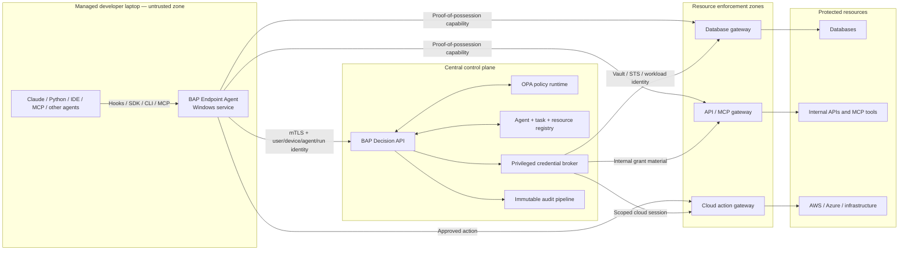

# Recommendation

Do not throw away the existing `C:\Users\User\Downloads\bap` project, but do not deploy it as-is.

Use:

- The laptop demo as the prototype for the managed endpoint adapter.
- The existing `bap` repository as the starting point for the central authorization control plane.
- A new gateway layer near protected resources as the actual enforcement boundary.

The production design should have four BAP-owned deployment types—not one server per module:

1. One managed endpoint service per laptop.
2. One horizontally scaled BAP decision API.
3. One internal privileged credential-broker tier.
4. Shared enforcement gateways deployed near protected resources.

OPA, Entra ID, Vault, AWS STS, KMS, PostgreSQL, Kafka, and SIEM are supporting platforms, not additional BAP products.

I made no code changes during this review.

# What zero standing privilege means here

Today, developers often have reusable database passwords, cloud roles, API keys, or broad VPN connectivity. An agent can inherit or discover those privileges.

With BAP:

- The developer has no permanent database or production role.
- The agent has no permanent credential.
- The laptop adapter is allowed only to ask BAP for authority.
- BAP evaluates the user, device, agent, task, action, resource, and risk.
- An allowed request receives a capability lasting perhaps 30–300 seconds.
- The capability is bound to the exact agent run, device key, action, resource, and task.
- The resource gateway validates it immediately before execution.
- The capability expires automatically and can be revoked when necessary.

There will still be tightly controlled infrastructure identities for brokers and gateways. “Zero standing privilege” applies to developers and agents; infrastructure privileges must be minimized, workload-bound, monitored, and isolated.

# Proposed production architecture



This follows the NIST model of a policy decision point and enforcement points located close to the resources, minimizing the implicit trust zone. [NIST SP 800-207](https://nvlpubs.nist.gov/nistpubs/SpecialPublications/NIST.SP.800-207.pdf) and [SP 800-207A](https://csrc.nist.gov/pubs/sp/800/207/a/final) explicitly separate policy decisions from gateways and emphasize application/service identity rather than network location alone.

## 1. Managed endpoint agent

Install one signed Windows service on every managed laptop using Intune.

It should:

- Expose an authenticated Windows named pipe, not an unauthenticated loopback HTTP port.
- Support all agents through the same API.
- Register each agent run.
- Obtain the signed-in user identity through Windows/Entra token brokers.
- Use a TPM-backed device certificate and an ephemeral run key.
- Convert tool calls into canonical actions and resources.
- Hold capabilities or ephemeral credentials outside the model process.
- Forward execution through approved gateways.
- Record proposals, decisions, execution, and results.
- Fail closed for protected resources if BAP is unavailable.
- Allow ordinary local file/code operations without contacting BAP when policy classifies them as local.

Agents can integrate through:

- Claude lifecycle hooks.
- A local MCP server.
- Python, JavaScript, Go, or .NET SDKs.
- A CLI wrapper.
- IDE extensions.
- Database proxy/driver adapters.

An agent that ignores the adapter still cannot reach protected resources because the network and target reject direct access.

## 2. BAP decision API

This is the only externally reachable BAP control-plane API.

It should:

- Validate user, device, and agent-run assertions.
- Verify device compliance and endpoint-agent version.
- Resolve task/purpose binding from ServiceNow, Jira, or another authoritative source.
- Canonicalize the requested action and resource.
- Evaluate signed, versioned policy.
- Return allow, approval-required, or deny.
- Create a short-lived proof-of-possession capability.
- Never return database passwords or AWS secret keys to the model.
- Write the decision synchronously to durable audit infrastructure.

Run it as a stateless, autoscaled regional service. Put OPA in the same Kubernetes workload as a sidecar or use an equivalent embedded policy runtime. OPA does not need its own developer-facing hostname.

## 3. Privileged credential broker

The broker must be internal-only. Laptop clients must not reach it.

It exchanges approved BAP decisions for:

- Vault dynamic database users.
- Scoped AWS STS sessions.
- Azure managed/workload identities.
- Short-lived API credentials.
- Backend gateway session material.

This isolates Vault and cloud-role privileges from the internet-facing decision API.

The current implementation returns credentials directly in the API response:

- [Vault credentials](C:/Users/User/Downloads/bap/bap/connectors/vault.py:39)
- [AWS credentials](C:/Users/User/Downloads/bap/bap/connectors/aws_sts.py:40)

That contract must change. Secrets should be delivered only to an enforcement gateway or sealed to the endpoint service’s TPM/run key—not returned to an agent.

## 4. Resource enforcement gateways

A gateway is required for every protected resource class:

- Database gateway/proxy.
- API and MCP gateway.
- Cloud-action gateway.
- Administrative tool gateway.

The existing verifier is the beginning of this pattern, but it is currently only a demo that returns `forwarded: true`: [verifier_middleware.py](C:/Users/User/Downloads/bap/bap/connectors/verifier_middleware.py:24).

Production gateways must validate:

- Issuer and signing key.
- Stable gateway audience.
- Agent and user identity.
- Device identity and compliance claim.
- Agent-run ID.
- Task ID.
- Exact action and resource.
- Issue and expiration times.
- Policy version.
- Nonce and replay state.
- Proof-of-possession key.
- Usage count or transaction constraints.
- Revocation status for higher-risk operations.

# Network segmentation

Managed Claude settings cannot stop a developer from writing their own Python script. Network and target-side controls must make bypass ineffective.

| Source | Destination | Required policy |
|---|---|---|
| Developer laptop | Production databases | Always deny |
| Developer laptop | Vault or credential broker | Always deny |
| Developer laptop | Cloud administrative APIs | Deny or force through controlled proxy; no usable base identity |
| Developer laptop | BAP decision API | Allow HTTPS/mTLS from compliant devices |
| Developer laptop | Approved resource gateways | Allow only through ZTNA/private access |
| BAP decision API | Databases/business data | Deny |
| BAP decision API | Registry, policy, KMS, audit | Allow narrowly |
| Credential broker | Vault/STS | Allow using workload identity |
| Database gateway | Assigned databases | Allow exact ports and target identities |
| API/MCP gateway | Assigned tools | Allow exact services |
| Database/resource subnet | Developer/VPN subnet | Always deny |
| Resource | Gateway subnet/service identity | Allow |

Important implementation points:

- Put gateways in dedicated subnets or security groups close to each resource.
- Resource firewall rules must allow only gateway identities/subnets.
- Do not allow broad developer VPN routes into database or production subnets.
- Use private endpoints, private DNS, NSGs/security groups, and default-deny routing.
- Use separate gateway groups for development, production, and high-sensitivity systems.
- Apply equivalent controls whether the laptop is in the office, at home, or on a different network.
- Endpoint firewall restrictions are helpful, but upstream firewalls and resource ACLs are authoritative.
- Use ZTNA/SASE to expose only gateway applications, not whole subnets.

Microsoft’s Zero Trust guidance similarly recommends microsegmentation, identity-aware gateways, secure web gateways, and moving enforcement close to applications and data. [Microsoft Zero Trust networking](https://learn.microsoft.com/en-us/security/zero-trust/workshop-zero-trust-networking), [Azure segmentation guidance](https://learn.microsoft.com/en-us/security/zero-trust/azure-networking-segmentation).

# Preventing Claude settings tampering

Use endpoint-managed settings, not project-local settings.

For Windows, current Claude Code supports:

- `HKLM\SOFTWARE\Policies\ClaudeCode`, with JSON in the `Settings` value.
- `C:\Program Files\ClaudeCode\managed-settings.json`.
- Server-managed settings, with endpoint-managed fallback.

The old `C:\ProgramData\ClaudeCode` location is no longer supported in current Claude versions. [Claude Code settings documentation](https://code.claude.com/docs/en/settings).

Recommended managed settings include:

```json
{
  "minimumVersion": "2.1.241",
  "allowManagedHooksOnly": true,
  "allowManagedMcpServersOnly": true,
  "allowManagedPermissionRulesOnly": true,
  "forceRemoteSettingsRefresh": true,
  "wslInheritsWindowsSettings": true,
  "permissions": {
    "disableBypassPermissionsMode": "disable"
  },
  "allowedMcpServers": [
    {
      "serverName": "enterprise-bap"
    }
  ],
  "hooks": {
    "SessionStart": [],
    "UserPromptSubmit": [],
    "PreToolUse": [],
    "PermissionRequest": [],
    "PostToolUse": [],
    "SessionEnd": []
  }
}
```

The hooks should invoke a signed executable under `C:\Program Files\CompanyBAP\`, which communicates with the Windows service. Do not deploy mutable Python hooks in production.

Claude managed settings provide the highest configuration precedence, and `allowManagedHooksOnly` blocks user/project hooks. [Claude organization setup](https://code.claude.com/docs/en/admin-setup), [hooks documentation](https://code.claude.com/docs/en/hooks).

However, server-managed settings alone can be bypassed when users select third-party providers or a non-default `ANTHROPIC_BASE_URL`. This matters for your local-model bridge. Claude recommends endpoint-managed settings for stronger enforcement. [Server-managed settings limitations](https://code.claude.com/docs/en/server-managed-settings).

Additional endpoint controls:

- Remove permanent local administrator access.
- Provide just-in-time elevation for approved developer operations.
- Deploy the endpoint service as a signed Intune Win32 application.
- Protect its files and configuration using SYSTEM/admin ACLs.
- Use App Control for Business/WDAC to allow signed enterprise binaries and restrict unauthorized replacements.
- Enable Defender for Endpoint, EDR, tamper protection, Secure Boot, BitLocker, and TPM attestation.
- Require an Intune-compliant device through Conditional Access.
- Deny BAP issuance when the endpoint heartbeat, version, signature, or device posture is invalid.
- Monitor service termination, settings changes, hook removal, alternate Claude binaries, and unexpected provider configuration.

Microsoft warns that users with administrator privileges may circumvent managed-installer controls, so removing standing local admin remains important. [App Control managed installer guidance](https://learn.microsoft.com/en-us/windows/security/application-security/application-control/app-control-for-business/design/configure-authorized-apps-deployed-with-a-managed-installer). Device compliance can be required through Conditional Access, and Intune supports TPM-backed enrollment attestation. [Conditional Access compliance](https://learn.microsoft.com/en-us/entra/identity/conditional-access/policy-all-users-device-compliance), [Windows enrollment attestation](https://learn.microsoft.com/en-us/intune/device-enrollment/windows/attestation).

Even these controls cannot guarantee that a machine with hostile kernel-level administrator access is trustworthy. Treat a tampered device as compromised and make gateways deny it.

# Review of the existing `bap` repository

## Keep

The existing repository already has valuable pieces:

- Strict request models that reject unexpected fields.
- User OIDC verification.
- Signed agent assertions.
- Task/purpose binding.
- Deny-by-default OPA policies.
- Resource routing.
- Vault, STS, and signed-grant connector concepts.
- RS256/JWKS validation.
- Credential redaction from audit.
- Hash-chained audit records.
- Credential cleanup when audit persistence fails.

## Change before production

1. It claims to be stateless, but uses SQLite for agents, tasks, and audit: [README.md](C:/Users/User/Downloads/bap/README.md:3), [db.py](C:/Users/User/Downloads/bap/bap/db.py:10).

2. `/v1/audit` and `/v1/revoke` have no visible authentication or authorization: [main.py](C:/Users/User/Downloads/bap/bap/api/main.py:52).

3. It returns Vault passwords and AWS secrets to the client.

4. Signing keys are generated and stored as ordinary files: [keys.py](C:/Users/User/Downloads/bap/bap/connectors/keys.py:10).

5. The default Vault token is `root`, and the database payload disables TLS: [config.py](C:/Users/User/Downloads/bap/bap/config.py:23), [vault.py](C:/Users/User/Downloads/bap/bap/connectors/vault.py:42).

6. Signed grants are bearer tokens without proof-of-possession and cannot be revoked before expiration: [signed_grant.py](C:/Users/User/Downloads/bap/bap/connectors/signed_grant.py:37).

7. Agent assertions are not bound to device posture, a session nonce, or an ephemeral run key.

8. The verifier uses wildcard CORS and fetches JWKS on every request: [verifier_middleware.py](C:/Users/User/Downloads/bap/bap/connectors/verifier_middleware.py:19).

9. There is no approval service, idempotency handling, rate limiting, replay registry, tenant isolation, or production test suite.

10. There is currently no `tests` directory despite the pytest configuration.

# Service consolidation decision

| Existing concept | Production placement |
|---|---|
| FastAPI API, engine, OIDC verification | BAP Decision API |
| OPA | Sidecar or embedded runtime in the Decision API workload |
| Agent registry and task binding | Durable central stores/integrations |
| SQLite audit | Kafka/Event Hub plus immutable archive/SIEM |
| Vault/AWS connectors | Internal credential-broker workers |
| Signed grant connector | KMS/HSM-backed capability issuer |
| Verifier middleware | Shared gateway middleware/library |
| Laptop connector and Claude hook | Managed Endpoint Agent |
| ccbridge | Optional inference compatibility adapter; never an enforcement point |
| Demo HTML | Separate operational/admin UI, not part of authorization runtime |

This keeps useful code boundaries without turning every Python module into a public server.

# Scaling model

- Deploy the Decision API as stateless containers across regional cells.
- Store registry/task metadata in PostgreSQL or authoritative enterprise systems.
- Use Redis or another replicated store for nonce, idempotency, short-lived revocation, and rate limits.
- Use KMS/HSM for per-region signing keys and automated rotation.
- Publish signed policy bundles through GitOps with tests, review, canary rollout, and rollback.
- Scale gateways independently by traffic and resource zone.
- Run at least two gateways/connectors per critical zone.
- Buffer audit through Kafka/Event Hub and archive immutably.
- Cache identity keys, policy bundles, and safe metadata—not credentials or broad allow decisions.
- Fail closed for new protected-resource access during outages.
- Do not require a persistent connection from every laptop; short HTTPS/mTLS requests scale more simply.
- Begin with one resource type and one region rather than building every connector at once.

# Recommended delivery plan

## Phase 0 — Decisions and threat model

- Approve the four deployment types.
- Define protected resources and direct paths.
- Decide whether developers retain local admin.
- Define user, device, agent, run, and task identities.
- Define availability and fail-closed behavior.
- Produce architecture decision records and abuse cases.

Exit gate: security, endpoint, identity, network, and developer-platform teams approve the model.

## Phase 1 — Production contracts

- Define canonical action/resource names.
- Define endpoint registration and run-attestation protocols.
- Define proof-of-possession capability claims.
- Define decision, approval, execution, audit, and revocation APIs.
- Remove credentials from agent-facing response contracts.
- Define gateway verification SDK.

Exit gate: versioned OpenAPI/JSON schemas and threat-model tests.

## Phase 2 — Managed endpoint pilot

- Build signed Windows service and named-pipe API.
- Package through Intune.
- Deploy managed Claude settings and hooks.
- Add SDK, MCP, CLI, and Claude adapters.
- Integrate Entra user identity and TPM-backed device identity.
- Pilot with 20–50 laptops.

Exit gate: developers cannot disable the adapter without losing resource access.

## Phase 3 — Central control-plane hardening

- Move SQLite state to durable services.
- Put keys in KMS/HSM.
- Add authenticated audit/admin/revoke endpoints.
- Add policy GitOps, idempotency, rate limits, regional cells, approval orchestration, and immutable audit.
- Separate privileged brokers from the public API.

Exit gate: security testing and recovery exercises pass.

## Phase 4 — First real enforcement gateway

Start with a low-risk development database read:

- Deploy a database gateway.
- Remove direct developer DB routes.
- Make database ACLs accept only gateway identities.
- Issue short-lived read-only database credentials to the gateway.
- Prove missing, forged, expired, replayed, and mismatched grants fail.

Exit gate: direct access is technically impossible, not merely discouraged.

## Phase 5 — Production and additional adapters

- Add API/MCP gateway.
- Add cloud-action gateway.
- Add human approval for writes and production actions.
- Roll out network segmentation and Conditional Access.
- Expand by resource class and region.

## Phase 6 — Fleet rollout

- Deployment rings: security team, pilot developers, one business unit, broad fleet.
- Measure latency, denials, bypass attempts, availability, developer friction, and policy defects.
- Run regular tamper, revocation, key-rotation, and gateway-isolation exercises.

# Production implementation prompt

Use this only after the architecture and Phase 0 decisions are approved:

```text
You are implementing the production Bounded Authority Plane (BAP).

Repositories:
1. C:\Users\User\Downloads\bap
   - Treat this as the central-control-plane prototype.
2. C:\Users\User\Downloads\Laptop_BAP_CCD\laptop_bap_demo
   - Treat this as the endpoint-agent, Claude-hook, local-agent, and dashboard prototype.

Do not perform a blind rewrite. Preserve useful domain logic, but change trust boundaries and public contracts to match this architecture.

Required deployment products:
1. A signed Windows BAP Endpoint Agent using authenticated named-pipe IPC.
2. A stateless, horizontally scalable BAP Decision API.
3. An internal-only privileged credential broker.
4. Shared enforcement gateways near databases, APIs/MCP tools, and cloud control planes.

Security invariants:
- Agents never decide their own authority.
- Agents never receive database passwords, AWS secret keys, Vault tokens, or bearer capabilities.
- User identity must come from enterprise OIDC/Windows token acquisition.
- Device identity must be TPM/certificate-backed.
- Every run must have a connector-assigned run ID and ephemeral proof-of-possession key.
- Capabilities must bind issuer, audience, user, device, agent, run, task, action, resource, policy version, jti, iat, nbf, exp, and cnf key.
- Missing, forged, expired, revoked, replayed, or mismatched capabilities must fail closed.
- Protected targets must accept traffic only from enforcement gateways.
- The BAP decision service must not be in the business-data path.
- The public decision API must not hold Vault root tokens or cloud administrator credentials.
- Audit/revoke/admin endpoints require explicit administrative authorization.
- All decisions and execution events must be correlated and sent to immutable audit storage.
- Development bypass settings must be impossible in production builds.

Claude requirements:
- Support Windows managed settings through HKLM or C:\Program Files\ClaudeCode.
- Enable allowManagedHooksOnly, allowManagedMcpServersOnly, and allowManagedPermissionRulesOnly.
- Disable bypass-permissions mode.
- Support wslInheritsWindowsSettings.
- Managed hooks must invoke a signed executable, not Python source.
- Claude integration is one adapter; the endpoint API must also support MCP, CLI, and SDK clients.
- Network/resource enforcement must remain effective when Claude is bypassed entirely.

Implementation order:
A. Write ADRs, threat model, API schemas, capability schema, trust-boundary diagrams, and migration plan.
B. Add tests for all security invariants before changing runtime behavior.
C. Refactor the central API so it returns decisions and opaque execution handles, not credentials.
D. Move credential issuance into an internal broker interface.
E. Implement gateway verification middleware with JWKS caching, key rotation, replay protection, proof-of-possession, and revocation.
F. Implement the Windows endpoint-service interface and adapters.
G. Add durable PostgreSQL/Redis/audit integrations behind interfaces.
H. Add deployment manifests, Intune packaging guidance, managed Claude settings, observability, and runbooks.
I. Build one end-to-end database-read pilot before implementing additional connector types.

Repository rules:
- Never commit private keys, tokens, passwords, generated databases, or dev-mode credentials.
- Remove insecure defaults such as Vault root tokens and sslmode=disable.
- Keep dev mode in a separately packaged demo profile that cannot start in production.
- Use typed schemas with extra fields forbidden.
- Use mTLS for service communication.
- Use workload identity for brokers and gateways.
- Keep policy deny-by-default.
- All policy bundles must be signed, versioned, tested, and auditable.
- Do not create one public server per connector.
- OPA may run as a sidecar in the Decision API workload.
- Gateway instances scale per resource zone but share one implementation and verification contract.

Required deliverables before implementation approval:
1. Target architecture document.
2. Threat model with bypass and tamper scenarios.
3. Service-boundary ADR.
4. Endpoint enrollment and attestation design.
5. Network segmentation matrix.
6. Capability and proof-of-possession specification.
7. OpenAPI contracts.
8. Migration map from both prototypes.
9. Test strategy and measurable exit criteria.
10. Phased rollout and rollback plan.

Stop after producing those design deliverables. Do not modify runtime code until they are reviewed and explicitly approved.
```

The immediate next step should be Phase 0: approve the service boundaries, decide the local-admin policy, and select the first protected resource for the pilot. A development read-only database is still the best first production slice.